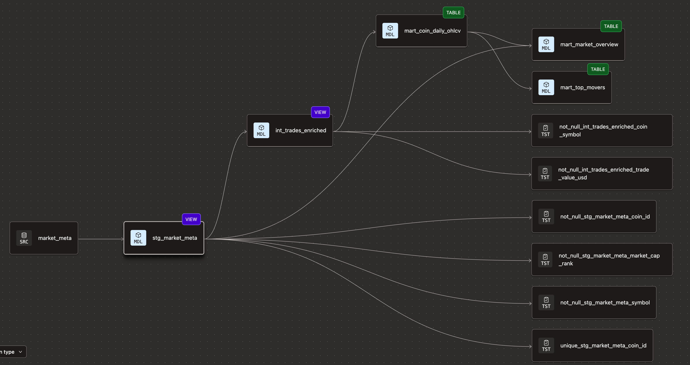

# Real-Time Crypto Analytics Platform

> End-to-end streaming pipeline: Binance WebSocket → Kafka (EC2) →
> PySpark Structured Streaming (EC2) → Delta Lake (S3) → dbt → Snowflake → Streamlit


## Architecture


## Infrastructure
| Component | Technology | Deployment |
|---|---|---|
| Message bus | Kafka 7.5.0 + Zookeeper + Schema Registry | EC2 t3.medium |
| Orchestration | Apache Airflow 2.8.1 | EC2 t3.small |
| Stream processing | PySpark Structured Streaming 3.4 | EC2 t3.large |
| Data lake | AWS S3 + Delta Lake | Managed |
| Warehouse | Snowflake (X-Small, auto-suspend 60s) | SaaS |
| Transformation | dbt-core + dbt-snowflake | Runs on Airflow EC2 |
| Dashboard | Streamlit | TBD Week 5 |
| IaC | Terraform ~> 5.0 (AWS + Snowflake providers) | GitHub Actions |
| CI/CD | GitHub Actions | GitHub |
| Local dev | Docker Compose (mirrors EC2 stack) | Laptop |


## Data Model (3-layer dbt architecture)

| Layer | Schema | Materialization | Purpose |
|-------|--------|----------------|---------|
| Staging | STAGING | View | Rename, cast — no business logic |
| Intermediate | STAGING | View | Joins, window functions, aggregations |
| Marts | MARTS | Table (clustered) | Dashboard-ready output |

### Mart tables
- `mart_coin_daily_ohlcv` — Daily OHLCV + VWAP per coin. Primary dashboard source.
- `mart_top_movers` — Top 20 gainers and losers by 24h change.
- `mart_market_overview` — Current price, market cap, dominance % per coin.

### dbt Lineage


## Local setup
```bash
git clone https://github.com/{username}/crypto-analytics-platform.git
cd crypto-analytics-platform
cp .env.example .env   # fill in API keys
docker compose up -d
# Airflow: http://localhost:8080 (admin/admin)
# Spark:   http://localhost:8082
# Schema Registry: http://localhost:8081
```

## Design decisions

**Three dedicated EC2 instances over a monolithic host**: Separating Kafka,
Airflow, and Spark onto dedicated instances reflects production architecture.
It also means each service can be right-sized independently — Spark gets a
t3.large for memory-intensive streaming; Airflow only needs a t3.small.

**Snowflake over Redshift Serverless**: Snowflake's auto-suspend (60s) makes
it genuinely cost-free when idle — critical for a portfolio project. The
dbt-snowflake adapter is the most mature dbt adapter, and Snowflake separates
storage/compute more cleanly than Redshift Serverless.

**Kafka over direct-to-S3 ingestion**: Decouples producers from consumers.
The Binance WebSocket producer writes at market speed without waiting for Spark
or S3. 10 partitions on crypto.trades enables parallel consumer scaling.

**Delta Lake over plain Parquet**: ACID transactions and time travel on S3 —
essential for safe upserts when CoinGecko enrichment backfills metadata.

**IAM instance profiles over access keys**: Spark and Airflow EC2 instances
assume IAM roles via the instance metadata service. No credentials on disk,
no keys to rotate, no risk of accidental commits.

**LocalExecutor for Airflow**: Sufficient for this pipeline's DAG complexity.
Removes Celery broker overhead. CeleryExecutor is the natural next step for
parallel task scaling.