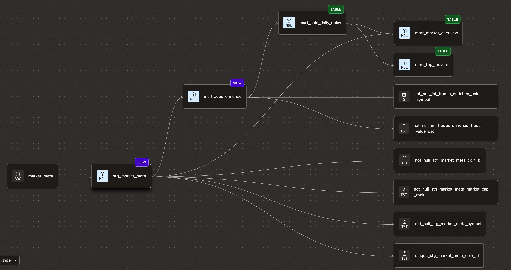
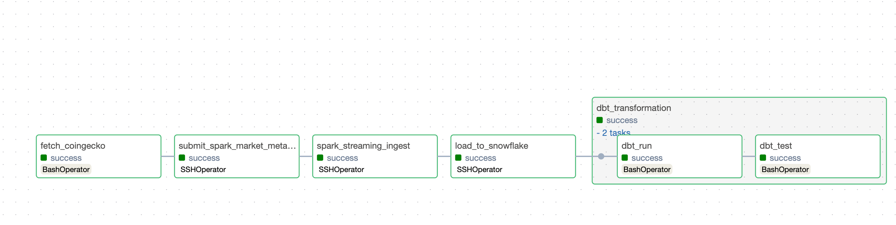
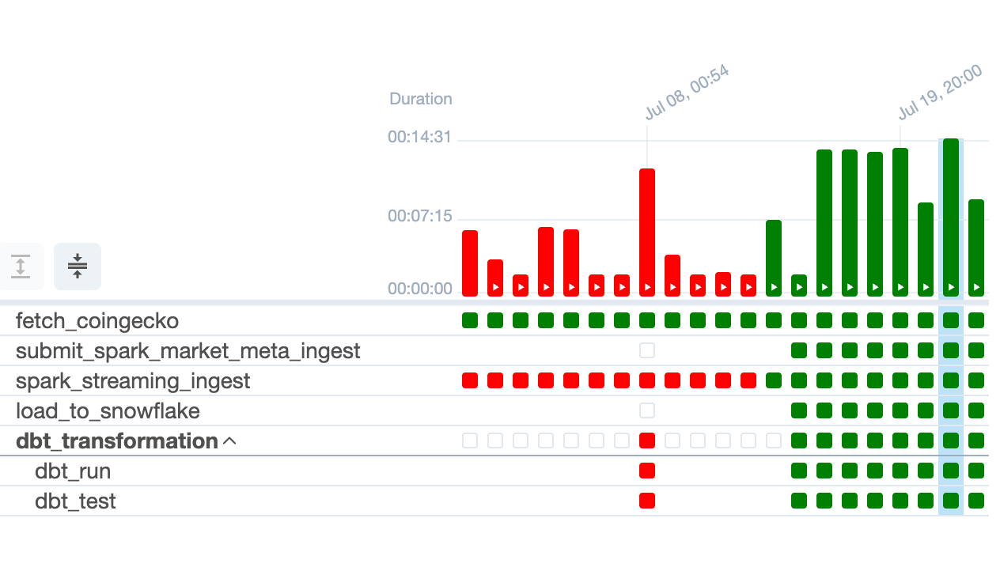
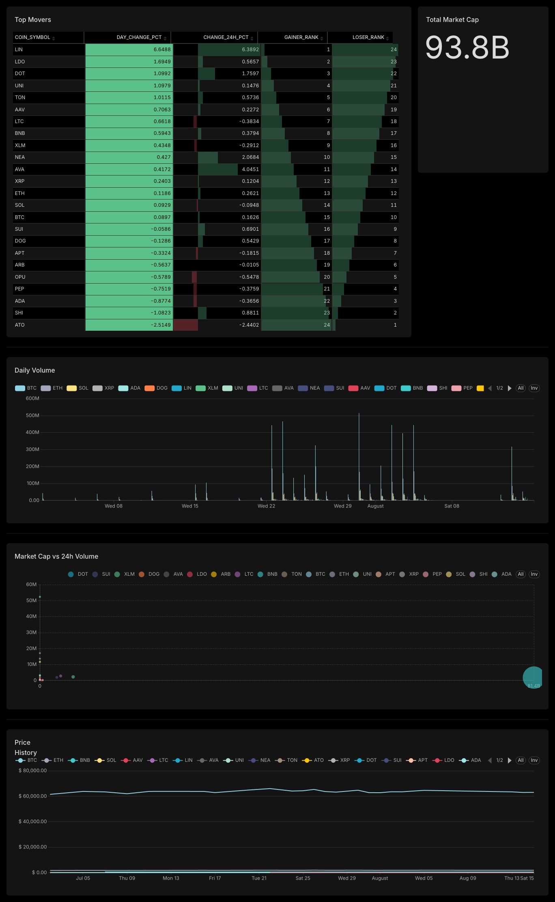

# Real-Time Crypto Analytics Platform

End-to-end streaming pipeline: Binance WebSocket → Kafka (EC2) → PySpark Structured Streaming (EC2) → Delta Lake (S3) → dbt → Snowflake → Apache Superset


---

## Architecture

```
Binance WebSocket
       │
       ▼
  Kafka (KRaft)          ← EC2 m7i-flex.large, 50 GB gp3
  crypto.trades (10p)
  crypto.ohlcv_1m (10p)
  crypto.market_meta (3p)
  crypto.trades.dlq (3p)
       │
       ▼
PySpark Structured       ← EC2 m7i-flex.large, 40 GB gp3
Streaming 3.4.4
       │
       ▼
Delta Lake on S3         ← AES-256, versioning, Glacier after 90d
  raw/binance/trades/
  raw/coingecko/
  curated/delta/trades/
  curated/delta/ohlcv/
       │
       ▼
Snowflake (XSMALL WH)   ← auto-suspend 60s, S3 storage integration via IAM role
  RAW → STAGING → MARTS
       │
       ▼
dbt (runs on Airflow EC2) → transforms + tests
       │
       ▼
Apache Superset  ← EC2 c7i-flex.large (serving)
```

---

## Infrastructure

| Component | Technology | Instance / Tier |
|---|---|---|
| Message bus | Kafka 7.7.0 (KRaft, no ZooKeeper) + Schema Registry | EC2 m7i-flex.large, 50 GB gp3 |
| Stream processing | PySpark Structured Streaming 3.4.4 + Spark History Server | EC2 m7i-flex.large, 40 GB gp3 |
| Orchestration | Apache Airflow 2.8.1 (LocalExecutor) | EC2 t3.small, 20 GB gp3 |
| Data lake | AWS S3 + Delta Lake (delta-spark 2.4.0) | Managed; raw → Glacier after 90 d |
| Warehouse | Snowflake XSMALL, auto-suspend 60 s | SaaS |
| Transformation | dbt-core 2.0 + dbt-snowflake 1.10 | Runs on Airflow EC2 |
| Dashboard | Apache Superset 8088 | EC2 c7i-flex.large |
| IaC | Terraform ≥ 1.6 (AWS + Snowflake providers) | Remote state in S3 |
| CI/CD | GitHub Actions | GitHub |
| Local dev | Docker Compose (mirrors EC2 stack) | Laptop |
| Secrets | AWS Secrets Manager | Fernet key, Snowflake creds |

---

## Performance Metrics

_Measured 2026-08-16 — end-to-end pipeline run_

| Pipeline Stage | p50 (ms) | p95 (ms) | p99 (ms) | Notes |
|---|---|---|---|---|
| Kafka producer → consumer | 0 | 0 | 1 | n=100 messages |
| Spark micro-batch processing | 30000 | N/A | N/A | 30-s trigger interval |
| Delta Lake S3 write | 216000 | N/A | N/A | window across log commits |
| Snowflake COPY INTO | 1503 | 2295 | 2295 | ~500K rows |

---

## Kafka Topics

| Topic | Partitions | Purpose |
|---|---|---|
| `crypto.trades` | 10 | Raw tick trades from Binance WebSocket |
| `crypto.ohlcv_1m` | 10 | 1-minute OHLCV aggregates |
| `crypto.market_meta` | 3 | CoinGecko metadata enrichment |
| `crypto.trades.dlq` | 3 | Dead-letter queue for failed records |

Log retention: 24 hours / 10 GB per partition. Topics are created idempotently on bootstrap — safe to re-run.

---

## S3 Data Lake Layout

```
crypto-analytics-lake-{initials}/
├── raw/
│   ├── binance/trades/     # raw tick data from Kafka
│   └── coingecko/          # metadata enrichment backfills
├── curated/
│   └── delta/
│       ├── trades/         # ACID Delta table, upserts safe
│       └── ohlcv/          # 1-minute OHLCV aggregates
├── checkpoints/            # Spark Structured Streaming checkpoints (expire 30d)
├── spark-logs/             # Spark History Server event logs
└── logs/
```

S3 bucket is private (all public access blocked), AES-256 encrypted, versioned. Raw data transitions to Glacier after 90 days; checkpoints expire after 30 days.

---

## Snowflake Data Model (3-layer dbt architecture)

| Layer | Schema | Materialization | Purpose |
|---|---|---|---|
| Staging | `STAGING` | View | Rename columns, cast types — no business logic |
| Intermediate | `STAGING` | View | Joins, window functions, aggregations |
| Marts | `MARTS` | Table (clustered) | Dashboard-ready output |

### Mart tables

- `mart_coin_daily_ohlcv` — Daily OHLCV + VWAP per coin. Primary dashboard source.
- `mart_top_movers` — Top 20 gainers and losers by 24-hour change.
- `mart_market_overview` — Current price, market cap, and dominance % per coin.

### dbt Lineage



---

## Airflow DAGs

Airflow runs with `LocalExecutor` on a t3.small. DAGs sync from this repo every 5 minutes via a cron job (`git pull origin main`). The Fernet key is generated on first boot and persisted to Secrets Manager so it survives instance replacement.

The Snowflake credentials (account, user, password, database, warehouse, role) are injected into the Airflow container via environment variables sourced from Secrets Manager at startup.

### Airflow Screenshots

Airflow Graph View


Airflow Task Duration


---

## IAM & Security

All EC2 instances authenticate to AWS via **IAM instance profiles** — no access keys on disk.

| Role | Permissions |
|---|---|
| `crypto-spark-role` | S3 read/write on data lake + Secrets Manager (Snowflake creds) + SSM |
| `crypto-airflow-role` | S3 read/write + Secrets Manager (Snowflake creds + Fernet key) |
| `crypto-serving-role` | Secrets Manager (Snowflake creds) |
| `crypto-snowflake-s3-role` | S3 read on `raw/` and `curated/` (assumed by Snowflake via storage integration) |

Snowflake's S3 storage integration uses a two-step IAM trust policy: Terraform creates the role with a bootstrap trust policy, then patches it with the real Snowflake IAM user ARN and external ID once the integration object exists.

Security groups restrict each port to the minimum required source: Kafka port 9092/29092 accepts only VPC CIDR and your laptop IP; Airflow UI (8080) and Streamlit (8501) accept only your laptop IP.

---

## Local Setup

```bash
git clone https://github.com/satvikjadhav/crypto-analytics-platform.git
cd crypto-analytics-platform
cp .env.example .env   # fill in API keys + Snowflake creds
docker compose up -d
```

| Service | URL |
|---|---|
| Airflow | http://localhost:8080 (admin / admin) |
| Spark UI | http://localhost:8082 |
| Spark History | http://localhost:18080 |
| Schema Registry | http://localhost:8081 |
| JupyterLab | http://localhost:8888 |

The local Docker Compose stack mirrors the EC2 topology: Kafka (KRaft), Schema Registry, Spark master + worker + history server, JupyterLab, and Airflow with a LocalExecutor backed by Postgres.

---

## Deploying to AWS

Prerequisites: Terraform ≥ 1.6, AWS CLI configured, an S3 bucket named `tf-state-crypto-analytics-sj` for remote state, and an SSH key pair at `~/.ssh/crypto_analytics_key.pub`.

```bash
cd terraform
cp terraform.tfvars.example terraform.tfvars  # fill in variables
terraform init
terraform plan
terraform apply
```

Terraform provisions: VPC + subnet + IGW + route table, four EC2 instances (Kafka, Spark, Airflow, Serving), Elastic IPs for each, security groups, IAM roles and instance profiles, the S3 data lake bucket, Snowflake warehouse + database + schemas + pipeline user + role, Secrets Manager secrets (Fernet key, Snowflake credentials), and the Snowflake S3 storage integration.

Bootstrap scripts run on first boot via `user_data`. Each instance registers a systemd service so the stack restarts automatically after a reboot.

```bash
# Outputs after apply
terraform output airflow_url          # http://<ip>:8080
terraform output superset_url         # http://<ip>:8088
terraform output spark_public_ip
terraform output kafka_public_ip
```

To tear down:
```bash
terraform destroy
```

---

## Design Decisions

**Dedicated EC2 instances over a monolithic host.** Kafka, Spark, and Airflow each run on separate instances. This matches production architecture and lets each service be right-sized independently — Spark gets an m7i-flex.large for memory-intensive streaming, Airflow only needs a t3.small.

**KRaft over Kafka + ZooKeeper.** The Kafka instance runs in KRaft mode (broker + controller combined), eliminating a separate ZooKeeper process. One fewer service to operate, and KRaft is the direction Kafka itself is heading.

**Snowflake over Redshift Serverless.** Snowflake's 60-second auto-suspend makes it effectively free when idle — important for a portfolio project. The dbt-snowflake adapter is the most mature dbt connector, and Snowflake's compute/storage separation is cleaner than Redshift Serverless.

**Kafka over direct-to-S3 ingestion.** Kafka decouples the Binance WebSocket producer from Spark and S3. The producer writes at market speed without waiting for a downstream consumer. 10 partitions on `crypto.trades` enables parallel Spark consumer scaling without repartitioning.

**Delta Lake over plain Parquet.** ACID transactions and time travel on S3 make safe upserts possible when CoinGecko enrichment backfills metadata into existing partitions. Plain Parquet has no upsert story.

**IAM instance profiles over access keys.** Spark and Airflow EC2 instances assume IAM roles via the instance metadata service. No credentials on disk, nothing to rotate, no risk of accidental commits.

**LocalExecutor for Airflow.** Sufficient for this pipeline's DAG complexity. It removes Celery broker overhead. CeleryExecutor is the natural next step if parallel task scaling becomes necessary.

**Secrets Manager for the Fernet key.** The key is generated on first boot and written to Secrets Manager immediately, so a replacement instance can retrieve it without re-encrypting stored connections and variables.

---

## Repository Structure

```
.
├── dags/                   # Airflow DAGs
├── dbt/                    # dbt project (staging → intermediate → marts)
│   ├── models/
│   │   ├── staging/
│   │   ├── intermediate/
│   │   └── marts/
│   └── dbt_project.yml
├── producers/              # Binance WebSocket producer
├── spark/                  # PySpark Structured Streaming jobs
├── terraform/              # All infrastructure-as-code
│   ├── bootstrap/
│   │   ├── airflow.sh
│   │   ├── kafka.sh
│   │   └── spark.sh
│   ├── main.tf
│   ├── variables.tf
│   ├── airflow.tf
│   ├── kafka.tf
│   ├── spark.tf
│   ├── serving.tf
│   ├── snowflake.tf
│   ├── s3.tf
│   ├── network.tf
│   └── outputs.tf
├── docker-compose.yml      # Local dev stack
├── .env.example
└── .github/
    └── workflows/
        └── ci.yml
```

## Sample Dashboard Image(s)

